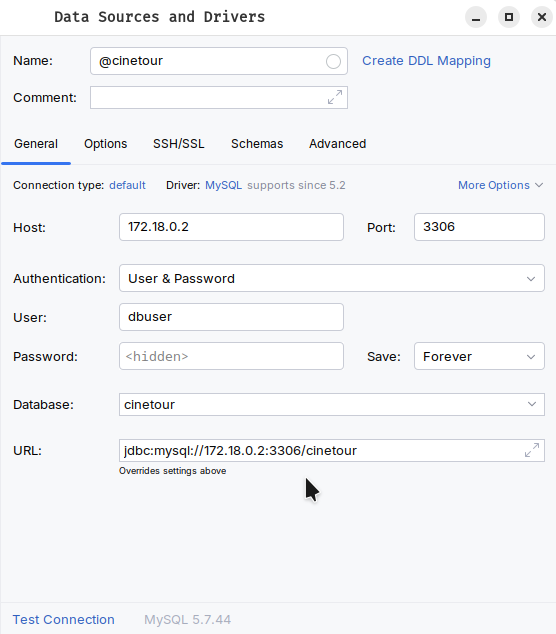

# Backend

## Sommaire

- [Backend](#backend)
  - [Sommaire](#sommaire)
  - [Commandes utiles (Cheatsheet)](#commandes-utiles-cheatsheet)
    - [Gradle](#gradle)
    - [Docker](#docker)
  - [Utilisation du Makefile](#utilisation-du-makefile)
  - [Procedure de lancement en local](#procedure-de-lancement-en-local)
    - [Etapes](#etapes)
  - [Visualisation des données](#visualisation-des-données)


<br>

## Commandes utiles (Cheatsheet)
Ces commandes sont utiles pour des opérations courantes liées au backend. Elles doivent être exécutées depuis la racine du backend.

### Gradle

- **Supprimer le répertoire `build`**  
  Utile lorsque les changements ne semblent pas être reconnus.
  ```sh
  ./gradlew clean
  ```

- **Nettoyer et construire le backend en ignorant les tests**  
  ```sh
  ./gradlew clean build -x test
  ```

- **Construire le backend**  
  ```sh
  ./gradlew build
  ```

- **Lancer le backend**  
  ```sh
  ./gradlew bootRun
  ```

- **Lancer les tests**  
  ```sh
  ./gradlew test
  ```

### Docker

- **Lister les conteneurs Docker Compose**  
  ```sh
  docker compose ps
  ```

- **Supprimer une image Docker**  
  Exemple :
  ```sh
  docker image rm -f image-cinetour-backend
  ```

- **Arrêter et supprimer les conteneurs, réseaux, volumes et images**  
  Exemple :
  ```sh
  docker compose -p cinetour down --volumes --rmi all
  ```

- **Voir les logs d'un conteneur**  
  ```sh
  docker compose logs cinetour-mysql-1
  ```

- **Démarrer et arrêter les conteneurs tout en conservant l'état de la base de données**  
  ```sh
  docker compose -p cinetour start
  docker compose -p cinetour stop
  ```

<br>

## Utilisation du Makefile

Afin de simplifier les étapes de la procédure de lancement en local, vous pouvez utilisez les commandes suivantes :

1. **Lancer l'application avec le profil par défaut**
    Cette commande nettoie, construit et lance les conteneurs Docker avec le profil par défaut. La base de données est crée vide.

    ```sh
    make
    ```

2. **Lancer l'application avec le profil d'importation**
    Cette commande nettoie, construit et lance les conteneurs Docker avec le profil d'importation. La base de données est créée et remplie en important les films du dataset IMDb.

    ```sh
    make all-import
    ```

<br>

## Procedure de lancement en local

Suivez les étapes numérotées ci-dessous pour lancer le backend localement avec Docker.

> Pré-requis :
Avant toute modification ou redémarrage, si des conteneurs, réseaux ou volumes existent déjà, il est recommandé de les nettoyer pour éviter les conflits. Utilisez la commande suivante :
   
```sh
docker compose -p cinetour down --volumes --rmi all
```

### Etapes

1. **Nettoyer et construire le backend**  
  
    Cette étape génère les fichiers nécessaires à l'exécution du backend en nettoyant d'abord les artefacts existants.
    
    ```sh
    ./gradlew clean build
    ```

2. **Créer les conteneurs et construire les images avec Docker Compose**

    Cette commande crée les conteneurs nécessaires à l'exécution du backend et de la base de données, en générant les images Docker si besoin.

    - Avec le profil par défaut :
    ```sh
    docker compose -p cinetour up --build
    ```

    - Avec le profil d'importation :
    ```sh
    SPRING_PROFILES_ACTIVE=import docker compose -p cinetour up --build
    ```

<br>

## Visualisation des données
> Note : Si vous souhaitez accéder à la base de données avec un client plutôt qu'en lignes de commandes, suivez les étapes suivantes.

1. **Récupérer l'IP du conteneur MySQL**  
   ```sh
   docker inspect -f '{{range.NetworkSettings.Networks}}{{.IPAddress}}{{end}}' cinetour-mysql-1
   ```

2. **Configurer la connexion avec un client lourd**  
    Utilisez les informations d'utilisateur et de mot de passe définies dans le `docker-compose.yml` ainsi que l'IP récupérée à l'étape précédente.

    

---